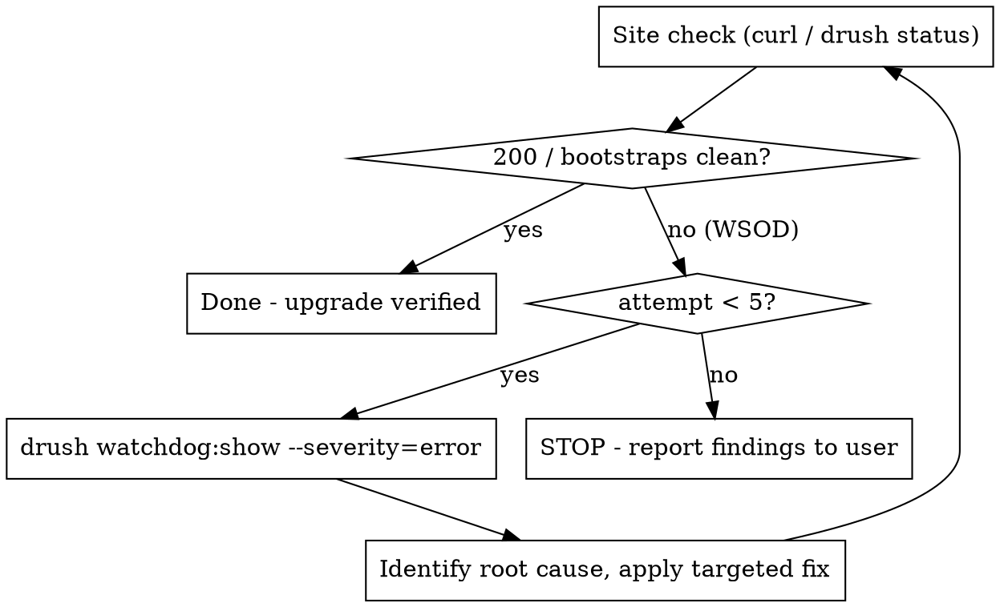

# D11 Upgrade

## Overview

This is the execution plan for upgrading this project from Drupal 10 to Drupal 11, driven entirely by the two audit reports already produced by `ddev pre-upgrade` and its bundled CKEditor checklist. It does not re-derive what needs upgrading - it reads that from the reports and executes against it in a fixed order, with a hard-capped WSOD recovery loop at the end so a broken upgrade can't turn into an unbounded retry spiral.

**REQUIRED BACKGROUND:** Use `drupal-d10-to-d11-upgrade` for the underlying mechanics referenced below (removed core modules table, PHP 8.4 nullable patches, the uninstall-before-delete rule, the `updb -> cim -> updb` sequence, entity-definition updates, WSOD diagnosis commands). This skill is the project-specific orchestration on top of that reference.

## When to Use

- The user asks to execute, run, start, or continue the D11 upgrade on this project.
- `.ddev/commands/host/reports/pre-upgrade.md` and `.ddev/commands/host/reports/ckeditor5-checklist.md` already exist (if not, run `ddev pre-upgrade` first - it generates both).
- Not for: auditing only (`ddev pre-upgrade` on its own already does that), or a first-time exploration of what upgrading would involve.

## Phase 0: Read the reports before touching anything

Read, in full:
1. `.ddev/commands/host/reports/pre-upgrade.md` - environment versions, orphan/removed-core-module blockers, the has-path / no-path / not-installed module buckets, custom module/theme list, drupal-check findings.
2. `.ddev/commands/host/reports/ckeditor5-checklist.md` - whether CKEditor 4 is in use and, if so, which plugin-providing modules are compatible vs not.
3. `.ddev/commands/host/reports/pre-upgrade-upgrade-status-raw.txt` - not needed in full up front, but keep it on hand; Phase 3d greps it for per-file deprecated-API detail on removed-core-module replacements.

If any report is missing or older than the current codebase state (composer.json/lock changed since generation), re-run `ddev pre-upgrade` and re-read before proceeding. Do not proceed from memory of a prior conversation's report contents - re-read the files now.

Any **CRITICAL orphan enabled module** or PHP fatal blocker listed in section 2/4/5 of `pre-upgrade.md` must be resolved before Phase 3 - those block Drush bootstrap and/or the deprecation scanners, so nothing downstream can be trusted until they're clear.

## Phase 1: CKEditor 4 -> 5 (do this first, before any other code change)

Check `ckeditor5-checklist.md`'s first line of substance:

- **CKEditor 4 not in use:** skip this phase entirely. Do not touch CKEditor config.
- **CKEditor 4 in use:** for each plugin-providing module listed:
  - Already `Compatible` (has a `*.ckeditor5.yml`): confirm its toolbar button ids still match what's configured in the CKE4 toolbar - no plugin behavior change expected.
  - `NOT compatible`: this module has no CKEditor5 plugin yet. Either find/patch a version that adds one, or find a replacement module providing equivalent CKEditor5 functionality. Do not drop the functionality silently.

  Migrate text formats one at a time (`/admin/config/content/formats` or the equivalent config change), and for each:
  1. Record the current CKE4 toolbar row/button order and the full active plugin list before changing anything.
  2. Switch the format's editor to CKEditor5.
  3. Rebuild the CKE5 toolbar to match the recorded order as closely as CKE5's toolbar model allows (CKE5 groups differently in places - note where an exact match isn't possible and why).
  4. Confirm every plugin/button that was active under CKE4 has a CKE5 equivalent present in the new toolbar - nothing silently dropped.

Do not proceed to Phase 3 module updates until every in-use CKE4 format is migrated or explicitly deferred with the user's sign-off.

## Phase 2: (reserved - matches report section numbering; no separate action)

Phase 1 covers CKEditor. There is no separate phase 2 action - proceed to Phase 3, which is `pre-upgrade.md` section 4 in numbering only.

## Phase 3: Work through `pre-upgrade.md`'s module buckets, in this order

### 3a. Custom modules/themes -> D11-compatible + tests

For every entry in `pre-upgrade.md`'s "Custom modules and themes" table:
1. Fix deprecated API usage (drupal-check/upgrade_status findings from sections 2 and 5, once those scans are unblocked - see Phase 0's critical-blocker note).
2. Update `core_version_requirement` in its `.info.yml` to include `^11`.
3. Add test coverage for the changed code, at all three levels where applicable:
   - **Unit test** (`tests/src/Unit/`) - pure logic, no Drupal bootstrap.
   - **Kernel test** (`tests/src/Kernel/`) - needs partial bootstrap + DB (services, plugins, entity CRUD).
   - **Functional/Integration test** (`tests/src/Functional/`) - full bootstrap, browser-driven, for anything user-facing (forms, routes, rendered output).
   Not every change needs all three - match the test level to what actually changed (a pure utility function needs a Unit test, not a Functional one).

### 3b. Composer-upgradeable modules ("has upgrade path")

For the "Has upgrade path" bucket in `pre-upgrade.md` section 4:
1. Batch by dependency relationship, not all at once (see `drupal-d10-to-d11-upgrade` Phase 4) - e.g. update a module and anything that requires it together, dry-run first.
2. `composer update <package> --with-all-dependencies --dry-run` before applying for real.
3. Re-run `composer why-not drupal/core 11.0.0 --locked` after each batch to confirm the blocker list is shrinking, not shifting.

### 3c. No-upgrade-path modules -> custom patch per module

For the "No upgrade path yet" bucket:
1. Check upstream (the module's issue queue) for an in-progress D11 patch before writing one from scratch.
2. Write a project-local patch (`patches/<module>/<module>-d11-compat.patch`) wired through `cweagans/composer-patches` in `composer.json`.
3. One patch file per module (or per theme), named for what it fixes, so a future contrib release can be diffed against it and the patch dropped when no longer needed.
4. Re-run the module through `drupal-check`/`upgrade_status` after patching to confirm the deprecation is actually resolved, not just silenced.

### 3d. Enabled D11-removed core modules/themes -> move to contrib + patch

For the "Drupal 11-removed core modules/themes still enabled" bucket:
1. Per module/theme, follow `pre-upgrade.md`'s recommended action column (install the named contrib replacement, or remove if no replacement exists).
2. Before touching it, grep `.ddev/commands/host/reports/pre-upgrade-upgrade-status-raw.txt` for the module's machine name - it carries the actual per-file deprecated-API findings (once that scan ran cleanly; see Phase 0's fatal-error note) that the summary table in `pre-upgrade.md` doesn't include. Use those findings to know exactly which calls need fixing in the contrib replacement or the patch you write in step 3, not just that the module is flagged.
3. **Uninstall before delete** (see `drupal-d10-to-d11-upgrade` Phase 7.0): `drush pm:uninstall <name> -y` while the D10 core code is still present, *then* `composer remove`/require the contrib replacement. Reversing this order leaves an orphan `system.schema` entry that breaks `updb`.
4. If the contrib replacement itself isn't yet D11-compatible, treat it like 3c: write a project-local patch, informed by the raw findings from step 2.
5. If the recommended action is plain removal (no replacement - e.g. `hal`, `rdf`, `quickedit`), confirm nothing in custom code references it (`grep -rn` its machine name across `web/modules/custom`, `web/themes/custom`) before uninstalling.

## Phase 4: Database update + cache clear

Follow the full sequence from `drupal-d10-to-d11-upgrade` Phase 7 (config_split deactivation, config export baseline, maintenance mode) - do not shortcut to just `drush updb`. Minimum sequence:

```
drush state:set system.maintenance_mode 1 --input-format=integer
drush updb -y
drush cim -y
drush updb -y
drush cr
```

Then check entity-definition updates:
```
drush php:eval "print_r(\Drupal::entityDefinitionUpdateManager()->getChangeSummary());"
```
Apply via `applyUpdates()` + `drush cr` if anything is pending.

## Phase 5-6: Verify the site, with a hard-capped WSOD loop



Each loop iteration:
1. Check the site (`curl -s -o /dev/null -w "%{http_code}" <local-url>` and `drush status`).
2. If clean: done, disable maintenance mode, move on.
3. If WSOD: `drush watchdog:show --severity=error --count=20`, plus PHP error log if watchdog itself can't log (bootstrap failure). Identify the *specific* root cause named in the error (file + line) - do not guess or apply an unrelated fix "just in case."
4. Apply exactly one targeted fix for that root cause, then loop back to step 1.

**Hard cap: 5 attempts total.** This is not a soft guideline.

| Rationalization | Reality |
|---|---|
| "One more try, I see the issue now" | That's what attempt 3 also said. Count the attempt. |
| "This fix is different, it'll definitely work" | Confidence isn't evidence. It still counts against the cap. |
| "The cap doesn't apply, this is a trivial follow-up fix" | Any fix-and-recheck cycle is an attempt. No exemptions. |
| "I'll just check watchdog once more without changing anything" | A no-op check doesn't consume an attempt; a check followed by any code/config change does. |

On hitting attempt 5 without a clean site: **stop**. Do not attempt a 6th fix. Report to the user: the current error (exact watchdog/PHP error text), every fix already tried and its outcome, and what you'd try next if authorized to continue. Let the user decide whether to continue, roll back, or bring in additional help.

## Phase 8: jQuery 4 compatibility for custom JS

D11 bundles jQuery 4, which drops the deprecated jQuery API that jQuery 3 still shimmed (`.bind()`, `.unbind()`, `.delegate()`, `.undelegate()`, `.live()`, `.die()`, `.size()`, `.andSelf()`, `jQuery.isArray`, `jQuery.isFunction`, etc.). Once the site boots on D11:

1. Grep custom module/theme JS for the deprecated call names above: `grep -rnE "\.(bind|unbind|delegate|undelegate|live|die|size|andSelf)\(|jQuery\.(isArray|isFunction)" web/modules/custom web/themes/custom --include=*.js`.
2. Install [`drupal/jquery_deprecated_functions`](https://www.drupal.org/project/jquery_deprecated_functions) via `ddev composer require drupal/jquery_deprecated_functions` and enable it - it restores these functions as a compatibility shim so existing custom JS keeps working without an immediate rewrite.
3. Treat the shim as a bridge, not a permanent fix: file/track follow-up work to actually rewrite the flagged custom JS to jQuery-4-native or vanilla-JS equivalents, since the shim module is a workaround for code that's still using a removed API, not a real fix.
4. Re-check the site (same check as Phases 5-6) after enabling the shim, since restoring these functions can itself change behavior if custom JS relied on jQuery 3's specific (already-deprecated) semantics.

## Final Step: Announce completion clearly

`ddev run-upgrade` launches Claude Code interactively and does not exit when this skill finishes - the session stays open, so a clearly-marked banner is the only signal the user gets that the upgrade run is actually done. End every run (success or stop) with one, not a plain trailing sentence:

On a clean verified site (Phase 5-6 succeeded):

```
================================
 D11 UPGRADE COMPLETE
================================
- Modules/themes updated: <list, or "none needed">
- Custom patches added: <list, or "none">
- CKEditor migration: <done / not applicable>
- WSOD fix attempts used: <N>/5
- Next step: run `ddev post-upgrade` to smoke-test the upgraded site
```

On hitting the 5-attempt WSOD cap (Phase 5-6 did not resolve):

```
================================
 D11 UPGRADE STOPPED - MANUAL REVIEW NEEDED
================================
- Current error: <exact watchdog/PHP error text>
- Fixes already tried: <list + outcome of each>
- Suggested next fix: <what you'd try next if authorized to continue>
```

## Quick Reference

| Phase | Source | Action |
|---|---|---|
| 0 | Both reports | Read fully before any change; resolve CRITICAL blockers first |
| 1 | `ckeditor5-checklist.md` | Migrate CKE4->5 per format, preserve plugins + toolbar order; skip if already CKE5 |
| 3a | `pre-upgrade.md` custom modules/themes | Fix deprecations, bump `core_version_requirement`, add Unit/Kernel/Functional tests |
| 3b | `pre-upgrade.md` "Has upgrade path" | `composer update` in dependency-aware batches, dry-run first |
| 3c | `pre-upgrade.md` "No upgrade path yet" | Custom patch per module via `cweagans/composer-patches` |
| 3d | `pre-upgrade.md` "D11-removed core modules/themes" + `pre-upgrade-upgrade-status-raw.txt` | Cross-check raw findings, uninstall-before-delete, install contrib replacement, patch if needed |
| 4 | - | Maintenance mode -> `updb` -> `cim` -> `updb` -> entity updates -> `cr` |
| 5-6 | - | Check site; on WSOD, `watchdog:show`, targeted fix, recheck |
| 7 | - | Max 5 fix attempts, then stop and report to the user |
| 8 | Custom JS under `web/modules/custom`, `web/themes/custom` | Grep for deprecated jQuery API usage, install `drupal/jquery_deprecated_functions` as a bridge, track real rewrite separately |
| Final | - | Print a clearly-marked `D11 UPGRADE COMPLETE` (or `STOPPED`) banner - the CLI session stays open otherwise |

## Common Mistakes

- Migrating CKEditor after already updating contrib modules - do it first, so toolbar/plugin regressions aren't tangled up with unrelated dependency changes.
- Deleting a removed-core-module's code before uninstalling it from the DB (orphans `system.schema`, breaks `updb`).
- Running `composer update` with no package argument to "just get it over with" - always batch and dry-run.
- Treating the 5-attempt WSOD cap as a suggestion. It exists specifically to stop repeated speculative fixes from compounding into a worse-broken site.
- Skipping test coverage on custom code changes because "it's just a deprecation fix" - a deprecated-API swap can silently change behavior; that's exactly what tests are for.
- Treating `jquery_deprecated_functions` as the finished fix rather than a bridge - it unblocks the upgrade, it doesn't excuse leaving custom JS on a removed API indefinitely.
